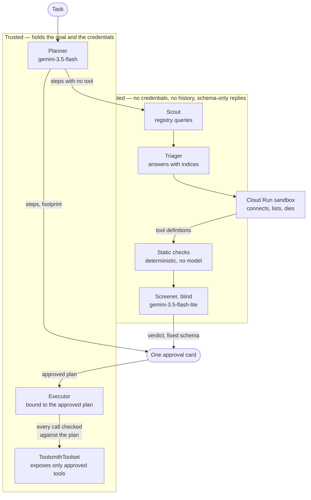

# Toolsmith

**Know what a task will touch before you let it run.**

An agent can only do what its tools and permissions allow, so the real
question before handing over a job is not "which model" but *what will this
actually reach*. Toolsmith answers that first: it works out every step a task
requires, which held tool performs each one, and the exact set of permissions
those steps exercise — then asks once, before anything happens.

If some step has no tool, it says so up front, and refuses to ask for
approval at all. Being told a task is impossible now is worth more than
discovering it halfway through, with permission already granted.

The unit of consent is the task, not the tool. Nobody wants to be interrupted
four times about servers they have never heard of.

> Built for the Google **All Things Agentic** hackathon — *Fortified Enterprise
> Fleet* track. Gemini 3.5 · ADK 2.7 · Cloud Run.

---

## One approval, honestly costed

Bundling only works if the bundle is shown honestly. A single approval that
hides what it covers is how consent screens became something people click
past, so the card carries the whole footprint rather than a summary of it:
every permission in plain words, its risk, and nothing the task would not
touch. A tool that is attached but unused for this job contributes nothing —
answering with the agent's whole standing authority would be the same
overstatement this exists to correct.

Permission names are never shown bare. Almost nobody knows GitHub's `repo`
scope reaches every private repository on the account, which is exactly why
over-broad access gets approved: the string looks modest and the consequence
is written nowhere the person clicking can see it.

## Screening, for anything not already trusted

Where a tool is not already held, the same engine screens candidates before
they can be attached: registry discovery, an isolated probe, and a verdict.
Existing MCP evaluation tools solve the opposite problem under opposite
constraints:

|                | Existing MCP eval / CI | Toolsmith screening |
| -------------- | ---------------------- | ------------------- |
| When           | Offline, batch         | Online, in-loop     |
| Scale          | Hundreds of tasks      | A handful of candidates |
| Budget         | Minutes, cost tolerated | Seconds, must be cheap |
| Who is waiting | Nobody                 | A human             |

A registry's tool description is, in practice, a self-authored resume. Reading
one to decide what to attach is closer to picking a restaurant from reviews
the restaurant wrote itself.

## Architecture

Two facts shape this, and neither is task complexity.

The system has to read text written by whoever published a tool, while holding
the user's credentials. Those cannot share a context, so they do not.

And the material worth reading does not exist until you connect: the registry
publishes no tool definitions, so descriptions and schemas are only visible
after opening a session with a server nobody has vetted. First contact
therefore happens in a disposable Cloud Run instance rather than in the
agent's process.



Nothing crosses back from the untrusted side except a schema. If the screener
is successfully injected, this is the entire blast radius:

```python
{'decision': 'block', 'granted_scopes': [], 'finding_codes': ['injection_in_description']}
```

No prose crosses the boundary, because prose is the attack.

### The isolation is enforced, not promised

Each property below is a construct, not a line in a prompt:

| Property | Mechanism |
| -------- | --------- |
| Screener cannot see the goal or history | `include_contents='none'` |
| Screener cannot emit free-form text | `output_schema=Verdict` |
| Screener cannot plan, loop, or ask | `mode='single_turn'` |
| Screener cannot hand back control | `disallow_transfer_to_*` |
| Server cannot expose unapproved tools | `McpToolset(tool_filter=...)` |
| Executor cannot exceed the approved plan | `before_tool_callback` refuses the call |
| First contact never touches the agent's process | Cloud Run sandbox |

The last two are the ones that make a single approval safe to give. An
approval that authorises a task and then permits whatever the agent decides
next is a blank cheque with a consent screen attached — so out-of-plan calls
are refused before they reach a server, and that refusal is
[tested](scripts/check_enforcement.py) rather than asserted.

### Computation and judgment are separated

Whether a description changed since it was approved, whether the publisher
signed it, whether the schema is well-formed — these are computable. Computing
them is strictly better than asking a model: attacker text cannot argue with a
diff, and it keeps the latency budget for the questions that genuinely need
reading comprehension.

## Status

Discovery, sandboxed probing, screening and the approval card run end to end.
Orchestrator wiring and the Cloud Run deployment are still outstanding.

```
bench     23 cases   0 dangerous through   0 clean blocked   median 0.86s
servers    6 live    0 misses
```

The bench screens tool definitions written into a file, which exercises the
judge and never the path that fetches them. The six servers are real, started
and probed, and one of them cannot be expressed as a bench case at all:
`rugpull` answers `tools/list` differently the second time it is asked. That
behaviour exists only across two calls, and the probe's double listing is what
catches it.

Two cases — a tool that lies in its schema, and one that lies in its scope
request — flicker between `warn` and `block` across runs. Both fail safe, and
the distinction between them is genuinely fine, but it is instability rather
than a decision, and it is reported rather than tuned away.

Two of those lines matter more than the accuracy count.

**`clean blocked: 0`** is measured deliberately. Four cases exist only to be
passed — an unsigned entry from nobody in particular, a legitimate tool whose
documentation contains an assistant-directed usage example, a tool with a
parameter named `force`, a read-only search needing no scopes at all. A
screener that blocks these is not cautious, it is useless, and most of the
tuning work so far has been holding this number at zero.

**Median 1.12s** is what makes screening viable while a human waits, and it is
the line between this and an offline eval product.

Over-broad scope requests are answered by cutting the scope, not by rejecting
the tool: a candidate asking for GitHub's `repo` scope to file an issue is
attached with `issues:write` and a warning, and the card shows both. `block`
is reserved for what cannot be cut away — injected instructions, impersonated
publishers, and scopes that are catastrophic at any width.

### What the real registry looks like

The bench was written by the same author as the screener, so it only ever
showed internal consistency. Pointing the probe at the live registry was what
broke that, immediately:

Of 40 entries the registry lists as **active with an open endpoint**, 15
answered. Nineteen refused the session or demanded a key, three failed in
other ways, two did not resolve, and one served a self-signed certificate —
a listed, active server whose identity cannot be established at all.

Screening the tools that did answer caught a defect no invented case had.
Real descriptions routinely say things like *"Use x711_web_search first to
find the URL, then this tool to read it"*, and the screener was blocking them
as injected instructions. That is documentation explaining where a tool sits
in a sequence, and blocking it would make the product unusable against real
registries. Two of those descriptions are now in the bench verbatim.

The registry is also unreliable about what a server *is*: one entry named for
Slack turned out to serve sixty financial-data tools.

## Deployed

The sandbox runs on Cloud Run, which is what makes the isolation claim a fact
rather than a description — first contact with an unvetted server happens in a
container that holds no credentials and is torn down afterwards.

```
toolsmith-sandbox    the probe service; the only component that must be remote
toolsmith-github     an MCP server the demo can actually complete a task with
toolsmith-injected   an MCP server that carries an injected instruction
```

The two servers are deployed rather than run locally for the same reason: a
sandbox on Cloud Run cannot reach `localhost`, and a sandbox that can is not
isolated. Every connection in the demo is a real hop between real services.

```bash
export TOOLSMITH_SANDBOX_URL=https://toolsmith-sandbox-111259597572.us-central1.run.app
export TOOLSMITH_CATALOG=fixtures/catalog/demo.json
```

Without `TOOLSMITH_SANDBOX_URL` the system refuses to probe rather than
falling back to the local path. A misconfigured deploy that quietly started
connecting from the agent's own process would look exactly like everything
working.

Pre-flight against that deployment: plan in ~3.5s, and ~10s including
discovery, an isolated probe and screening of every candidate for each gap.
That is before the task starts, not during it.

## Setup

```bash
conda create -n toolsmith python=3.12 -y
conda activate toolsmith
pip install -r requirements.txt
```

> `pip install mcp` on its own pulls MCP SDK 2.0, which ADK 2.7 cannot use.
> The pin in `requirements.txt` (`google-adk[mcp]`) is deliberate.

Provide a Gemini API key as either `GEMINI_API_KEY` or `GOOGLE_API_KEY` (the
SDK reads both and prefers the latter; set only one):

```bash
cp .env.example .env    # then fill in the key
python scripts/run_bench.py
```

## Layout

```
toolsmith/
  agents/screener.py      blind judge — no tools, no history, no way back
  screening/schema.py     the contract that crosses the trust boundary
  screening/checks.py     deterministic checks that outrank the judge
  screening/candidate.py  untrusted registry entry + safe rendering
  screening/runner.py     one screening pass, static + judged, merged
  attach/toolset.py       runtime attach at granted scope
bench/cases.py            adversarial corpus
scripts/run_bench.py      scores decisions and latency
```
