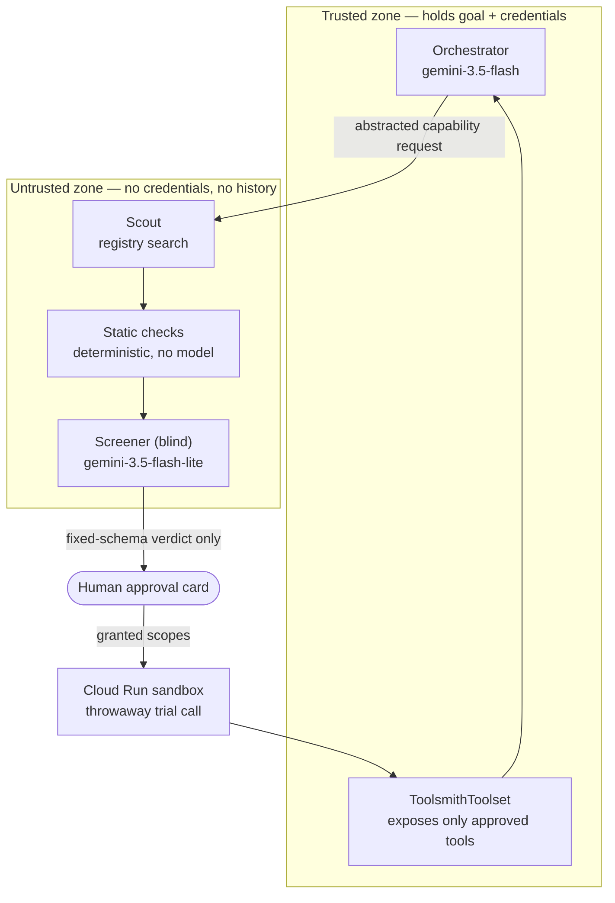

# Toolsmith

**An agent that acquires its own capabilities — safely.**

Most agents are shipped with a fixed set of tools. Toolsmith is shipped with
none. When it meets a request it cannot serve, it goes and finds the tool:
searches MCP registries for candidates, screens each one in isolation,
computes the minimum privilege that still does the job, and attaches it only
after a human approves a card showing exactly what was asked for versus what
was granted.

This agent does not build tools. It chooses them.

> Built for the Google **All Things Agentic** hackathon — *Fortified Enterprise
> Fleet* track. Gemini 3.5 · ADK 2.7 · Cloud Run.

---

## Why the hard part is judgment, not discovery

Searching a registry is search. Attaching a server at runtime is a framework
feature. Both are commodity — Composio, Pipedream and Dynamic MCP already do
them.

The uncontested half is deciding, in the second before you attach it, whether
this particular server should be trusted with a credential. Existing MCP
evaluation tools solve the opposite problem under opposite constraints:

|                | Existing MCP eval / CI | Toolsmith screening |
| -------------- | ---------------------- | ------------------- |
| When           | Offline, batch         | Online, in-loop     |
| Scale          | Hundreds of tasks      | A handful of candidates |
| Budget         | Minutes, cost tolerated | Seconds, must be cheap |
| Who is waiting | Nobody                 | A human             |

A registry's tool description is, in practice, a self-authored resume. Reading
one to decide what to attach is closer to picking a restaurant from reviews
the restaurant wrote itself.

## Architecture

The agent has to read attacker-controlled text while holding the user's
credentials. That single fact — not task complexity — is what forces the
process boundary.



If the screener is successfully injected, everything it can return is this:

```python
{'decision': 'block', 'granted_scopes': [], 'finding_codes': ['injection_in_description']}
```

No prose crosses the boundary, because prose is the attack.

### The isolation is enforced, not promised

Each property below is an ADK construct, not a line in a prompt:

| Property | Mechanism |
| -------- | --------- |
| Screener cannot see the goal or history | `include_contents='none'` |
| Screener cannot emit free-form text | `output_schema=Verdict` |
| Screener cannot plan, loop, or ask | `mode='single_turn'` |
| Screener cannot hand back control | `disallow_transfer_to_*` |
| Server cannot expose unapproved tools | `McpToolset(tool_filter=...)` |
| Capability set changes mid-session | `BaseToolset.get_tools(ctx)` |

### Computation and judgment are separated

Whether a description changed since it was approved, whether the publisher
signed it, whether the schema is well-formed — these are computable. Computing
them is strictly better than asking a model: attacker text cannot argue with a
diff, and it keeps the latency budget for the questions that genuinely need
reading comprehension.

## Status

Early. Screening engine runs end to end against an adversarial bench:

```
cases                 : 7          (target: 20)
dangerous let through : 0
clean blocked         : 0
latency               : median 1.15s  max 1.35s
```

The latency number is the one that matters — it is what makes screening
viable while a human waits, and it is the line between this and an offline
eval product.

**Caveat, stated plainly:** the bench cases and the screener prompt were
written by the same author, so these numbers are a smoke test, not evidence
that screening beats a careful human. Harder, more ambiguous cases and entries
drawn from real registries are the next milestone.

## Setup

```bash
conda create -n toolsmith python=3.12 -y
conda activate toolsmith
pip install -r requirements.txt
```

> `pip install mcp` on its own pulls MCP SDK 2.0, which ADK 2.7 cannot use.
> The pin in `requirements.txt` (`google-adk[mcp]`) is deliberate.

Provide a Gemini API key as either `GEMINI_API_KEY` or `GOOGLE_API_KEY` (the
SDK reads both and prefers the latter; set only one):

```bash
cp .env.example .env    # then fill in the key
python scripts/run_bench.py
```

## Layout

```
toolsmith/
  agents/screener.py      blind judge — no tools, no history, no way back
  screening/schema.py     the contract that crosses the trust boundary
  screening/checks.py     deterministic checks that outrank the judge
  screening/candidate.py  untrusted registry entry + safe rendering
  screening/runner.py     one screening pass, static + judged, merged
  attach/toolset.py       runtime attach at granted scope
bench/cases.py            adversarial corpus
scripts/run_bench.py      scores decisions and latency
```
